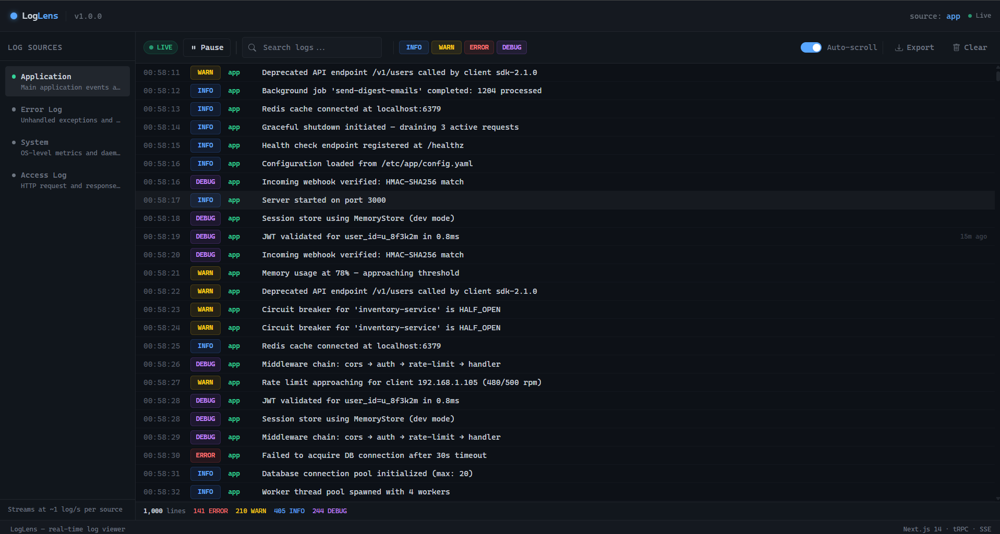
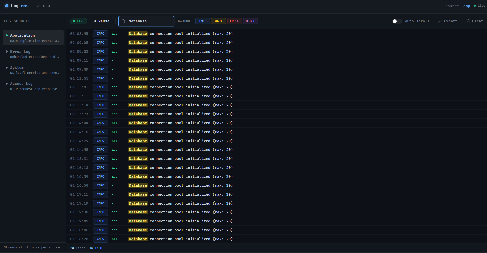
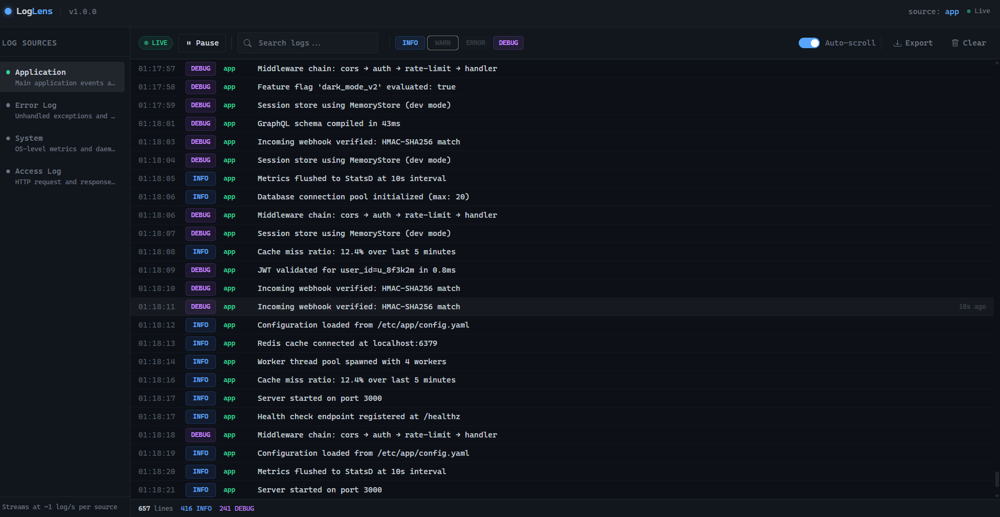
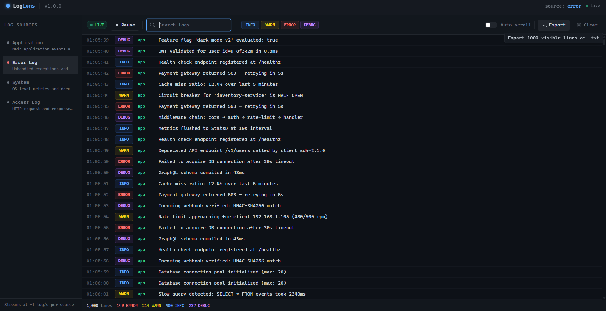
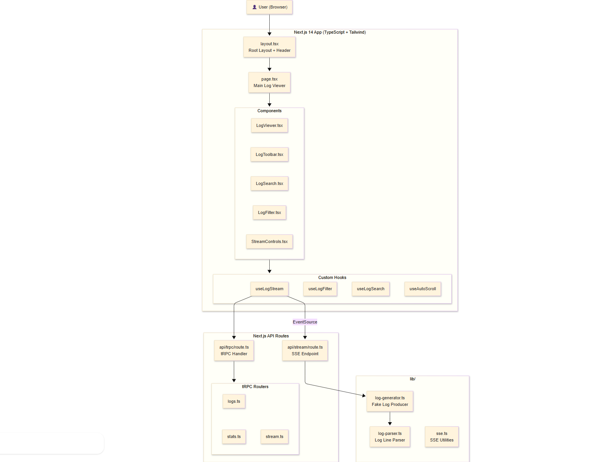

# 🔍 LogLens — Real-time Log Viewer for Developers
[](https://nextjs.org)
[](https://typescriptlang.org)
[](https://trpc.io)
[](https://tailwindcss.com)
[](https://zod.dev)
[](LICENSE)



**Real-time log viewer for developers who don't have time to tail files.**

Stream, filter, search, and export application logs with a terminal-style UI — no backend setup, no auth, no database. Just logs.

---

## ✨ Features

- **Real-time streaming** — logs arrive via SSE without page refresh
- **Multiple log sources** — switch between app, error, system, and access log streams
- **Keyword search** — type and matching lines highlight instantly across all fields
- **Level filtering** — toggle INFO / WARN / ERROR / DEBUG with color-coded badges
- **Pause & resume** — freeze the stream without losing buffered lines
- **Clear logs** — one click wipes the buffer
- **Auto-scroll** — snaps to bottom as new logs arrive; disable to inspect history
- **Line count** — live count of visible lines after filters are applied
- **Relative timestamps** — every line shows "2s ago", "14m ago" on hover
- **Copy on click** — click any line to copy the full formatted entry to clipboard
- **Export as .txt** — download all currently visible lines in a structured format
- **Dark terminal UI** — monospace font, ANSI-style color coding, zero chrome

---

## 🛠 Tech Stack

| Layer | Technology |
|---|---|
| Framework | Next.js 14 App Router |
| Language | TypeScript (strict) |
| API | tRPC v11 with superjson |
| Validation | Zod |
| Styling | Tailwind CSS |
| Streaming | Server-Sent Events (SSE) |
| State | React hooks (no external store) |

---

## Screenshots 

<table>
  <tr>
    <td width="50%"><p align="center">⚡ Live Streaming</p></td>
    <td width="50%"><p align="center">🔍 Keyword Search</p></td>
  </tr>
  <tr>
    <td width="50%"><p align="center">🎯 Log Level Filter</p></td>
    <td width="50%"><p align="center">📤 Export Logs</p></td>
  </tr>
</table>

---

## 🏗 Architecture



**Data flow for streaming:**

1. `useLogStream` opens an `EventSource` to `/api/stream?source=<source>`
2. The route handler calls `generateLogLine()` every ~800ms and pushes JSON via SSE
3. Incoming events are buffered in a ref and flushed to React state every 200ms (batched)
4. `useLogFilter` and `useLogSearch` derive the visible set from the buffered logs
5. `useAutoScroll` scrolls the container whenever the visible list grows

---

## 🚀 Getting Started

```bash
# 1. Clone
git clone https://github.com/mdryaan/loglens.git
cd loglens

# 2. Install
npm install

# 3. Configure (optional — works out of the box with defaults)
cp .env.example .env.local

# 4. Run
npm run dev
```

Open [http://localhost:3000](http://localhost:3000).

---

## 🔑 Environment Variables

| Variable | Default | Description |
|---|---|---|
| `NEXT_PUBLIC_APP_URL` | `http://localhost:3000` | Used by the tRPC server client for SSR requests |

---

## 🤝 Contributing

See [CONTRIBUTING.md](CONTRIBUTING.md) for how to add log sources, tRPC routes, and PR guidelines.

---

## 📄 License

MIT © 2026 [mdryaan](https://github.com/mdryaan)
